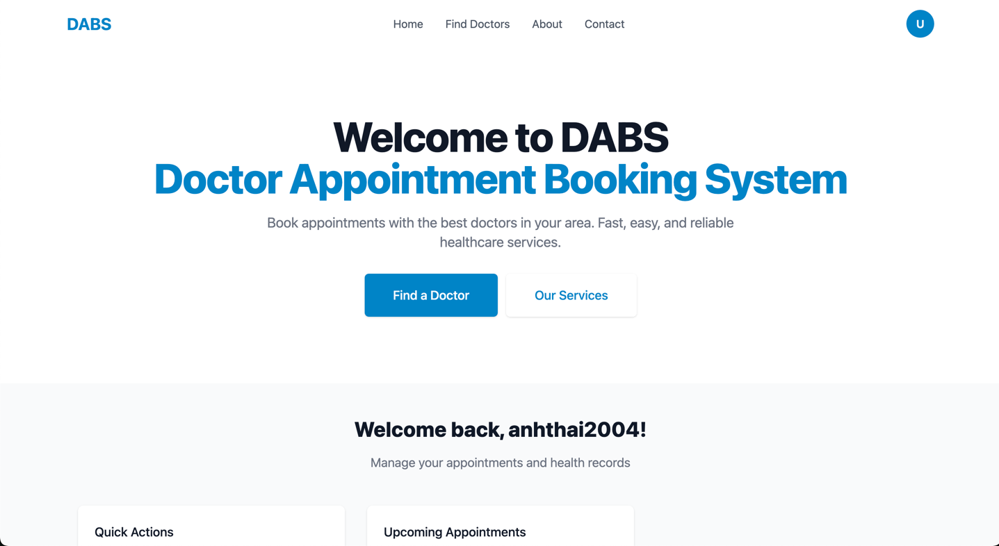

# 🩺 Doctor Appointment Booking System

Welcome to the **Doctor Appointment Booking System**, a modern and user-friendly web platform that enables patients to easily schedule medical appointments online. Designed to streamline the booking process, this system connects patients with healthcare professionals, making healthcare access more convenient and efficient.

## 🌐 Features
***
- 🗓️ **Easy Appointment Booking** – Book appointments with doctors in just a few clicks.
- 👨‍⚕️ **Doctor Profiles** – View doctor specialties, availability, and detailed profiles.
- 📅 **Smart Scheduling** – See available slots in real-time and receive instant confirmation.
- 🔔 **Reminders & Notifications** – Get appointment reminders via email.
- 🔒 **Secure & Private** – All patient data is protected and handled with care.

## 👥 Who is this for?
***
- **Patients** looking for a hassle-free way to find and book medical services.
- **Doctors/Clinics** aiming to manage their appointments more efficiently.

## 🚀 Technologies Used
***
- Frontend: React
- Backend: Spring-Boot, Redis
- Database: MySQL 
- Others: JWT Authentication, JavaMailSender, etc.

## 📸 Screenshot
***
**

## 🛠️ Setup Instructions
***
```bash
# Clone the repository
git clone https://github.com/your-username/doctor-appointment-booking-system.git
cd doctor-appointment-booking-system

# Install dependencies
npm install

# Start the development server
npm start