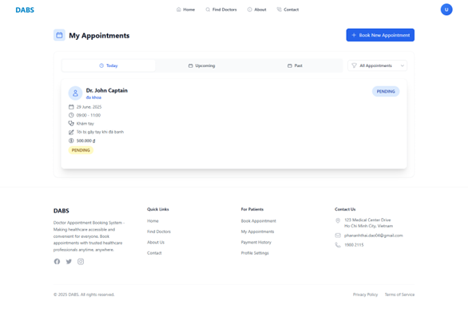
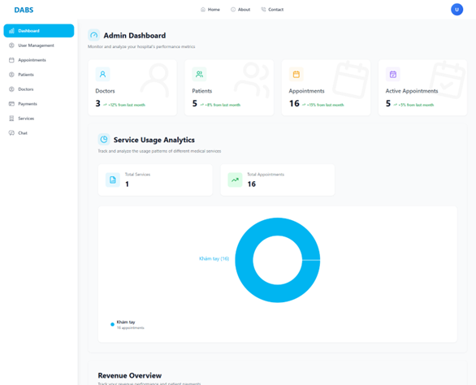

# 🩺 Doctor Appointment Booking System

Welcome to the **Doctor Appointment Booking System**, a modern and user-friendly web platform that enables patients to easily schedule medical appointments online. Designed to streamline the booking process, this system connects patients with healthcare professionals, making healthcare access more convenient and efficient.

## 🌐 Features

---

- 🗓️ **Easy Appointment Booking** – Book appointments with doctors in just a few clicks.
- 👨‍⚕️ **Doctor Profiles** – View doctor specialties, availability, and detailed profiles.
- 📅 **Smart Scheduling** – See available slots in real-time and receive instant confirmation.
- 🔔 **Reminders & Notifications** – Get appointment reminders via email.
- 🔒 **Secure & Private** – All patient data is protected and handled with care.

## 👥 Who is this for?

---

- **Patients** looking for a hassle-free way to find and book medical services.
- **Doctors/Clinics** aiming to manage their appointments more efficiently.

## 🚀 Technologies Used

---

- Frontend: React
- Backend: Spring-Boot, Redis
- Database: MySQL
- Others: JWT Authentication, JavaMailSender, etc.

## 📸 Screenshot

---

__
_Home Page_

---


_Booking Appointment_

---


_My Appointment_

_Admin Dashboard_

## 🛠️ Setup Instructions

---

```bash
    # Clone the repository
    git clone https://github.com/Ho4Vit/Doctor-Appointment-Booking-System.git
    cd Doctor-Appointment-Booking-System
    code .

    # Install dependencies
    npm install
    /bin/bash -c "$(curl -fsSL https://raw.githubusercontent.com/Homebrew/install/HEAD/install.sh)"
    brew install redis
    redis-server
    brew services start redis
```

FE

```bash
    # Start the development server
    npm run dev
```

Open: http://localhost:5173/

## <span style="color: yellow;"> 📁 Project Structure

---

```
├── .idea
├── DABS-BE/
├── DABS-FE/
├── Img/
└── README.md
```

## <span style="color: #FF9999;"> 🤝 Contribute

---

<div style="display: flex; flex-wrap: wrap; justify-content: center;">
    <a href="https://github.com/Ho4Vit">
        
    </a>
    <a href="https://github.com/Newbie1402">
        
    </a>
    <a href="https://github.com/JayT02z">
        
    </a>
</div>

<div style="text-align: center;">We look forward to your contributions to help make the project even better!</div>

## 📞 Contact

---

For bug reports and feature requests related to this software, please visit [GitHub Issues](https://github.com/Newbie1402/License-Plate-detection/issues). For questions, discussions, and community support, join our active communities on [Discord](https://discord.gg/3DmcPURR), and the [Zalo Community](https://zalo.me/g/uyzmad500). We're here to help with all things this project!
